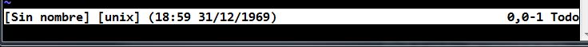

# **Vim**
Antes de hablar de vim primero debes saber que es vi, para esto se dara una breve definición de esta misma.

## **¿Que es VI?**
Es un programa que funciona como un editor de texto, fue desarrollado por el Sistema Operativo UNIX y esta programado en c, la version mejorada es vim .

## Vim 
vim es una version mejorada de vi , el cual hereda los comandos basicos de vi
> Vim , como su antecesor vi , se utiliza desde terminal en
> modo texto. Se controla por completo mediante teclado. Una
> de las ventajas de usar vim son sus atajos de teclado y 
> nos ayuda por completo a no levantar la mano del teclado


### **Configuraciones**
En la terminal colocamos el siguiente comando para abrir vim
```shell
    $ vim 
```
Y obtendremos esta interfaz en la terminal 


Soy consiente que quizá mucho de los leean este repositorio  cuando 
comenzarón a usar vim. Cuando comemence a utilizar vim de manera diaria que fue hace unas semanas , me frustraba ya que no conocia los comandos básicos, pero hoy vengo a ayudarlos ...

Como ya pudieron ver esa es la interfaz que se colocara en su terminal 
Recordar que esto solo funcionara en distribuciones linux 
Pero para las personas que quizá no tengan pueden hacer lo siguiente

* Usuarios Linux
    ```sh
        $ sudo apt-get install vim
    ```

* Usuario Windows
  - Usar [**gitbash**](https://git-scm.com/)

Para mas información visite [**AQUÍ**](https://intervia.com/doc/instalar-y-configurar-vim/)

Una ves instalado lo siguiente sera mejorar el aspecto visual en mi caso colocaré el siguiente comando para visualización de los numeros de lineas en vim
Para realizar esto debemos entender los siguiente que vim tiene dos componentes básicos la zona de comandos y la zona de inserción 

**Zona de comandos**
