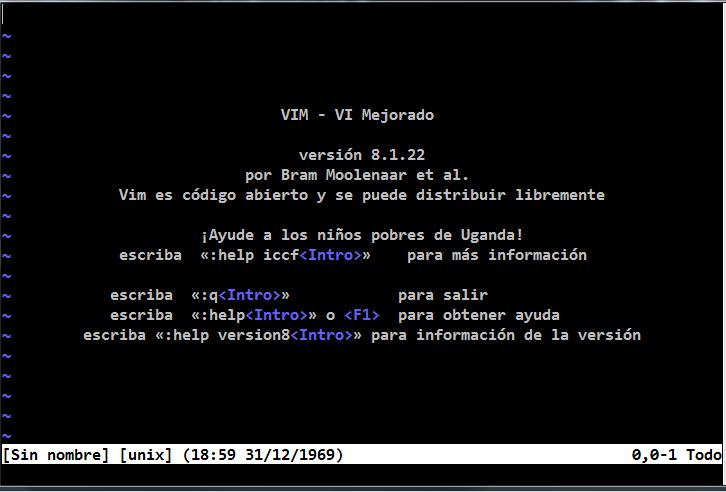

# **Vim**
Antes de hablar de vim primero debes saber que es vi, para esto se dara una breve definición de esta misma.

## **¿Que es VI?**
Es un programa que funciona como un editor de texto, fue desarrollado por el Sistema Operativo UNIX y esta programado en c, la version mejorada es vim .

## Vim 
vim es una version mejorada de vi , el cual hereda los comandos basicos de vi
> Vim , como su antecesor vi , se utiliza desde terminal en
> modo texto. Se controla por completo mediante teclado. Una
> de las ventajas de usar vim son sus atajos de teclado y 
> nos ayuda por completo a no levantar la mano del teclado


### **Configuraciones**
En la terminal colocamos el siguiente comando para abrir vim
```shell
    $ vim 
```
Y obtendremos esta interfaz en la terminal 

